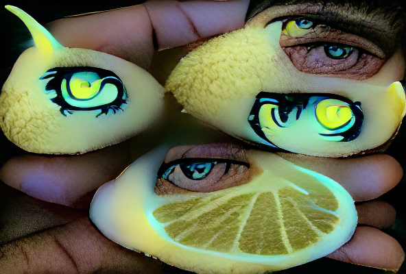

# AI Art Gen
For automating the creation of large batches of AI-generated artwork utilizing VQGAN+CLIP.  
Some example images that I've created via this process:  


# Requirements

You'll need an Nvidia GPU, preferably with a decent amount of VRAM. 12GB of VRAM is sufficient for 512x512 output images, and 8GB should be enough for 384x384. To generate 1024x1024 images, you'll need ~24GB of VRAM. Generating small images and then upscaling via [ESRGAN](https://github.com/xinntao/Real-ESRGAN) or some other package provides very good results as well.

# Install

Clone repo and run `run.sh` to install all dependencies
```
  git clone https://github.com/mikiui59/ai-art-gen.git
  cd ai-art-gen
  
  ./run.sh
```


# Usage

```
usage: vqgan.py [-h] [-p PROMPTS] [-ip IMAGE_PROMPTS] [-i MAX_ITERATIONS] [-se DISPLAY_FREQ] [-s SIZE SIZE]
                [-ii INIT_IMAGE] [-in INIT_NOISE] [-iw INIT_WEIGHT] [-m CLIP_MODEL] [-conf VQGAN_CONFIG]
                [-ckpt VQGAN_CHECKPOINT] [-nps [NOISE_PROMPT_SEEDS ...]] [-npw [NOISE_PROMPT_WEIGHTS ...]]
                [-lr STEP_SIZE] [-cutm {original,updated,nrupdated,updatedpooling,latest}] [-cuts CUTN] [-cutp CUT_POW]
                [-sd SEED] [-opt {Adam,AdamW,Adagrad,Adamax,DiffGrad,AdamP,RAdam,RMSprop}] [-o OUTPUT] [-vid] [-zvid]
                [-zs ZOOM_START] [-zse ZOOM_FREQUENCY] [-zsc ZOOM_SCALE] [-zsx ZOOM_SHIFT_X] [-zsy ZOOM_SHIFT_Y]
                [-cpe PROMPT_FREQUENCY] [-vl VIDEO_LENGTH] [-ofps OUTPUT_VIDEO_FPS] [-ifps INPUT_VIDEO_FPS] [-d]
                [-aug {Ji,Sh,Gn,Pe,Ro,Af,Et,Ts,Cr,Er,Re} [{Ji,Sh,Gn,Pe,Ro,Af,Et,Ts,Cr,Er,Re} ...]] [-vsd VIDEO_STYLE_DIR]
                [-cd CUDA_DEVICE]

Image generation using VQGAN+CLIP

optional arguments:
  -h, --help            show this help message and exit
  -p PROMPTS, --prompts PROMPTS
                        Text prompts (default: None)
  -ip IMAGE_PROMPTS, --image_prompts IMAGE_PROMPTS
                        Image prompts / target image (default: [])
  -i MAX_ITERATIONS, --iterations MAX_ITERATIONS
                        Number of iterations (default: 500)
  -se DISPLAY_FREQ, --save_every DISPLAY_FREQ
                        Save image iterations (default: 50)
  -s SIZE SIZE, --size SIZE SIZE
                        Image size (width height) (default: [512, 512])
  -ii INIT_IMAGE, --init_image INIT_IMAGE
                        Initial image (default: None)
  -in INIT_NOISE, --init_noise INIT_NOISE
                        Initial noise image (pixels or gradient) (default: None)
  -iw INIT_WEIGHT, --init_weight INIT_WEIGHT
                        Initial weight (default: 0.0)
  -m CLIP_MODEL, --clip_model CLIP_MODEL
                        CLIP model (e.g. ViT-B/32, ViT-B/16) (default: ViT-B/32)
  -conf VQGAN_CONFIG, --vqgan_config VQGAN_CONFIG
                        VQGAN config (default: checkpoints/vqgan_imagenet_f16_1024.yaml)
  -ckpt VQGAN_CHECKPOINT, --vqgan_checkpoint VQGAN_CHECKPOINT
                        VQGAN checkpoint (default: checkpoints/vqgan_imagenet_f16_1024.ckpt)
  -nps [NOISE_PROMPT_SEEDS ...], --noise_prompt_seeds [NOISE_PROMPT_SEEDS ...]
                        Noise prompt seeds (default: [])
  -npw [NOISE_PROMPT_WEIGHTS ...], --noise_prompt_weights [NOISE_PROMPT_WEIGHTS ...]
                        Noise prompt weights (default: [])
  -lr STEP_SIZE, --learning_rate STEP_SIZE
                        Learning rate (default: 0.1)
  -cutm {original,updated,nrupdated,updatedpooling,latest}, --cut_method {original,updated,nrupdated,updatedpooling,latest}
                        Cut method (default: latest)
  -cuts CUTN, --num_cuts CUTN
                        Number of cuts (default: 32)
  -cutp CUT_POW, --cut_power CUT_POW
                        Cut power (default: 1.0)
  -sd SEED, --seed SEED
                        Seed (default: None)
  -opt {Adam,AdamW,Adagrad,Adamax,DiffGrad,AdamP,RAdam,RMSprop}, --optimiser {Adam,AdamW,Adagrad,Adamax,DiffGrad,AdamP,RAdam,RMSprop}
                        Optimiser (default: Adam)
  -o OUTPUT, --output OUTPUT
                        Output filename (default: output.png)
  -vid, --video         Create video frames? (default: False)
  -zvid, --zoom_video   Create zoom video? (default: False)
  -zs ZOOM_START, --zoom_start ZOOM_START
                        Zoom start iteration (default: 0)
  -zse ZOOM_FREQUENCY, --zoom_save_every ZOOM_FREQUENCY
                        Save zoom image iterations (default: 10)
  -zsc ZOOM_SCALE, --zoom_scale ZOOM_SCALE
                        Zoom scale (default: 0.99)
  -zsx ZOOM_SHIFT_X, --zoom_shift_x ZOOM_SHIFT_X
                        Zoom shift x (left/right) amount in pixels (default: 0)
  -zsy ZOOM_SHIFT_Y, --zoom_shift_y ZOOM_SHIFT_Y
                        Zoom shift y (up/down) amount in pixels (default: 0)
  -cpe PROMPT_FREQUENCY, --change_prompt_every PROMPT_FREQUENCY
                        Prompt change frequency (default: 0)
  -vl VIDEO_LENGTH, --video_length VIDEO_LENGTH
                        Video length in seconds (not interpolated) (default: 10)
  -ofps OUTPUT_VIDEO_FPS, --output_video_fps OUTPUT_VIDEO_FPS
                        Create an interpolated video (Nvidia GPU only) with this fps (min 10. best set to 30 or 60)
                        (default: 10)
  -ifps INPUT_VIDEO_FPS, --input_video_fps INPUT_VIDEO_FPS
                        When creating an interpolated video, use this as the input fps to interpolate from (>0 & <ofps)
                        (default: 15)
  -d, --deterministic   Enable cudnn.deterministic? (default: False)
  -aug {Ji,Sh,Gn,Pe,Ro,Af,Et,Ts,Cr,Er,Re} [{Ji,Sh,Gn,Pe,Ro,Af,Et,Ts,Cr,Er,Re} ...], --augments {Ji,Sh,Gn,Pe,Ro,Af,Et,Ts,Cr,Er,Re} [{Ji,Sh,Gn,Pe,Ro,Af,Et,Ts,Cr,Er,Re} ...]
                        Enabled augments (latest vut method only) (default: [])
  -vsd VIDEO_STYLE_DIR, --video_style_dir VIDEO_STYLE_DIR
                        Directory with video frames to style (default: None)
  -cd CUDA_DEVICE, --cuda_device CUDA_DEVICE
                        Cuda device to use (default: cuda:0)
```

Random text generator: `python3 random_name_art.py`

# Example
```
  python3 random_name_art.py
  #lemon eye
  CUDA_LAUNCH_BLOCKING=1 python3 vqgan.py -s 600 400 -cd "cuda:0" -lr 0.085 -i 2500 -opt "RMSprop" -p "lemon eye" -in "gradient" -o output/l_eye.png'
```



## License

[MIT License](http://en.wikipedia.org/wiki/MIT_License)
